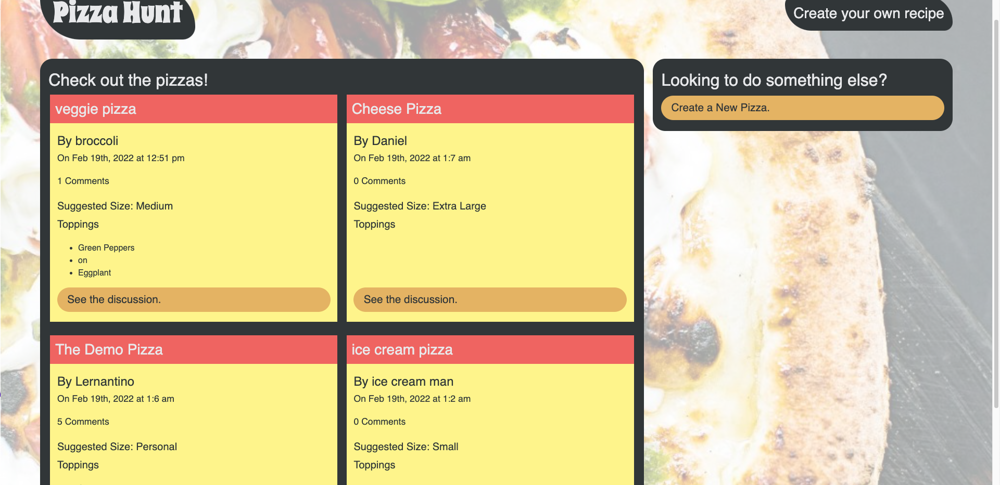

# pizza-hunt

## Description

A fun social media recipe app where users can post their creative spins on pizza, add comments to recipes, and create threads within comments creating following the MVC pattern

## Screen Shot

## Usage

In order to use this, you will need Node.js installed

Go to the root directory and open up the terminal, then type `npm install` to install, this will install the dependencies in the package.json file then type `npm start` to start the application

Go to to your web browser and type `localhost:3000` in order to use the application.

You don't have to create an account for this, simply click on create a new pizza and put your name, you or someone else can see your recipe and click on `see the discussion` where they will be able to leave comments and others can leave replies to their comments

## License

This application is not covered under any license

## Technologies

The technologies used were, IndexedDB, Node.js, HTML, CSS, Javascript

## Contributions

By Daniel Arzanipour

## Questions

[My Github](https://github.com/DanielArzani)

If you need to reach me for any additional questions, you can reach me at my [Gmail](mailto:daniel.arzanipour@gmail.com)
